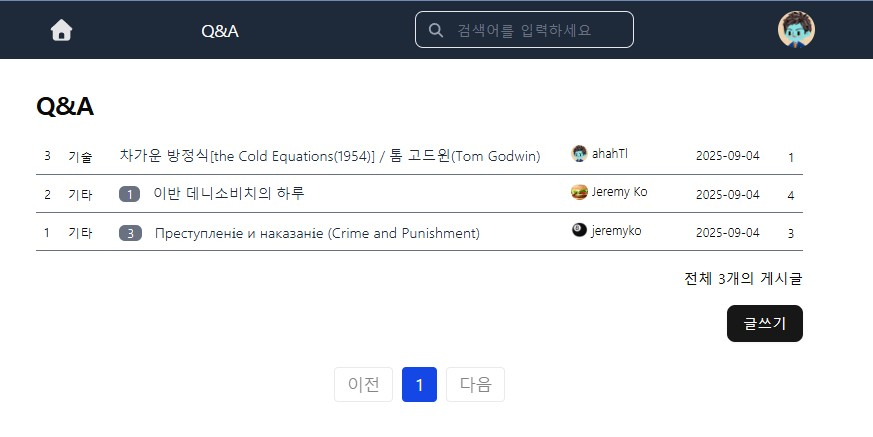

## 개요

[https://jeremyko.github.io/2025/08/30/nextjs-simple-board.html](https://jeremyko.github.io/2025/08/30/nextjs-simple-board.html)  

소스코드 동작확인 : [https://nextjs-simpleboard.vercel.app](https://nextjs-simpleboard.vercel.app)

next.js server action 과 react server component 를 사용해서 다음을 구현함.

- social login
- 댓글 및 대댓글 기능
- quill editor 사용
- 이미지,동영상 저장시 blob url 활용
- pagination
- 검색
- 반응형 디자인
- 조회수 관리 기능 (남용 방지 위한 쿠키 사용)
- refresh token rotation 처리(oauth 로그인 access token 갱신 위한)

## Getting Started

First, run the development server:

```bash
npm run dev
# or
yarn dev
# or
pnpm dev
# or
bun dev
```

Open [http://localhost:3000](http://localhost:3000) with your browser to see the result.

## Screenshot 





